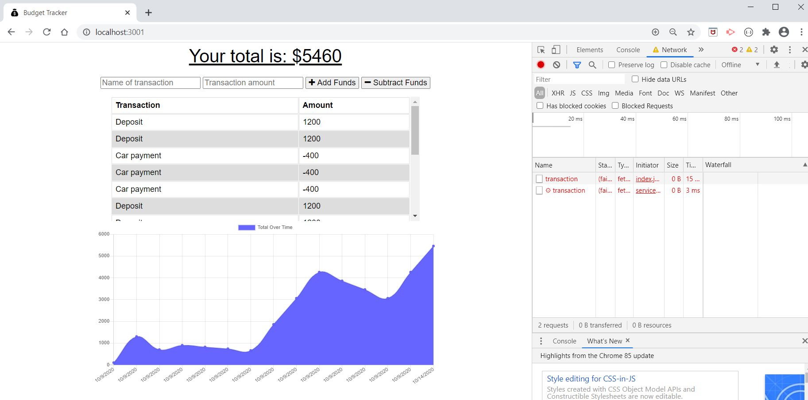
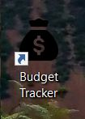
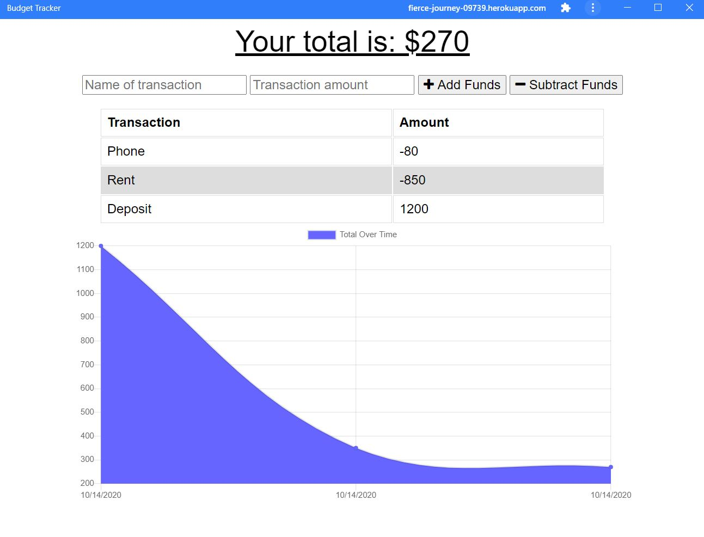

# Budget Tracker Challenge #19

## Challenge Description:
* A basic application for tracking deposits and withdrawals
* Application allows for offline access and functionality utilizing IndexedDB and service worker
* Offline transaction entries are added to tracker once app is back online
* Web Manifest manually included to download mobile-first application
* Application deployed on Heroku

## Screenshots:
<<<<<<< HEAD
##### Application deployed locally with offline functionality:

##### Downloadable application deployed to Heroku:

##### Installed application icon:

=======
##### Application deployed locally utilizing offline functionality:

##### Downloadable application deployed on Heroku:

##### Installed application icon:

>>>>>>> feature/readme
##### Standalone application running:

## Links:
#### Link to deployed application:
* https://fierce-journey-09739.herokuapp.com/
#### Link to Github repository:
* https://github.com/jenlpac/budget_tracker